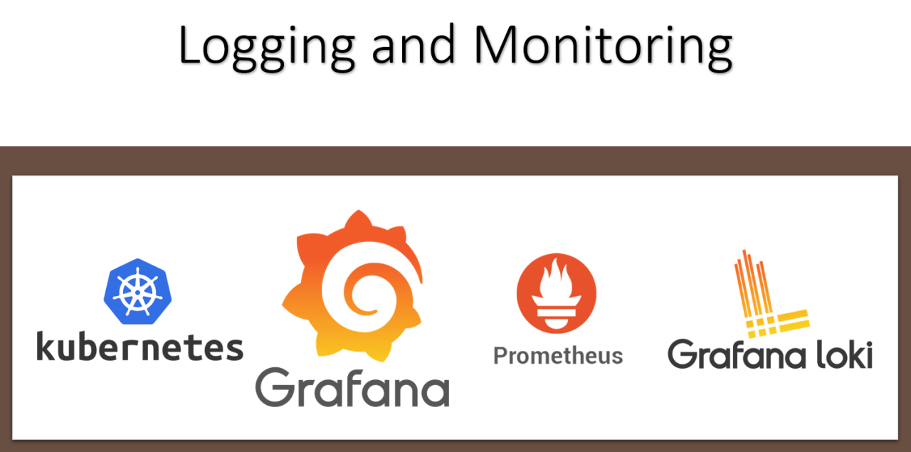

<h1 align="center">Monitoring and Logging</h1>

  
  

  <a href="#-projeto">Projeto</a>&nbsp;&nbsp;&nbsp;|&nbsp;&nbsp;&nbsp;
  <a href="#-tecnologias">Tecnologias</a>&nbsp;&nbsp;&nbsp;|&nbsp;&nbsp;&nbsp;
  <a href="#-roadmap">Roadmap</a>&nbsp;&nbsp;&nbsp;|&nbsp;&nbsp;&nbsp;
  <a href="#-referências">Referências</a>

  

## 💡 Projeto
- Laboratório para testes utilizando uma stack de monitoramento e logs. Realização de testes de autoscaling de aplicações utilizando o hpa e keda.

## ✨ Tecnologias
- Monitoring
    - Grafana
    - Prometheus
    - AlertManager
- Logging
    - Loki
    - Ptomtail
- Autoscaling
    - HPA
    - Keda
    - Metrics
- Kubernetes

## 👣 Roadmap

- [x] [Preparação de um Cluster Kubernetes utilizando o kubespray](/setup/setup-k8s-kubespray/kubespray/kubespray.md)
- [x] [Instalação do Helm](/helm/Readme.md)
- [x] [Instalação da stack de monitoramento](/monitoring/prometheus-stack/Readme.md)
- [x] [Instalação da stack logging](/logging/Readme.md)
- [x] [Instalação do Metrics Server](/monitoring/metrics-server/Readme.md)
- [x] [Instalação do Keda](/autoscaling/keda/Readme.md)
- [x] [Criar aplicações para realização de testes de escalonamento baseado em consumo de memória](/autoscaling/app/Readme.md)
- [x] Integração do grafana com o Prometheus
- [x] Integração do grafana com Loki;
- [x] [Criar Dashboard no grafana para visualização de logs](/dashboards/Readme.md)

## 📄 Referências

- https://kubernetes.io/docs/tasks/configure-pod-container/assign-memory-resource/

- https://kubernetes.io/docs/tasks/configure-pod-container/resize-container-resources/

- https://vertigo.com.br/kubernetes_hpa_memoria/

- https://keda.sh/docs/1.4/scalers/prometheus/

- https://github.com/prometheus-community

- https://github.com/grafana/loki

- https://grafana.com/docs/loki/latest/