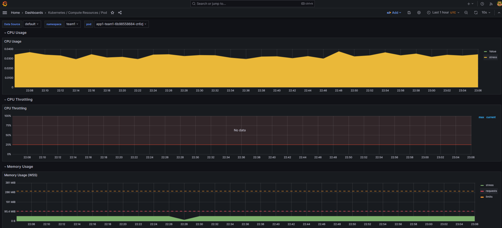

## Dashboards

- Logging

  

- Kubernetes Resources Namespace (Pod)

  

- Kubelet

  

- Alertmanager Overview

  

- Kubernetes Computer Resources Pod

  

- Kubernetes Computer Resources Workload

  

## Referências

- https://grafana.com/grafana/dashboards/14055-loki-stack-monitoring-promtail-loki/ 

- https://grafana.com/grafana/dashboards/16966-container-log-dashboard/ 