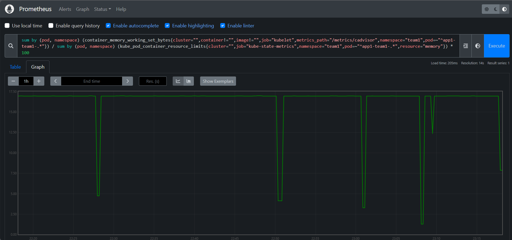

## Instalação Stack Prometheus

- Step 1: Adicionar repositórios Helm

```bash
helm repo add prometheus-community https://prometheus-community.github.io/helm-charts
helm repo update 
```
```c
Kube-Prometheus-stack, também como Operador Prometheus, é um projeto popular de código aberto que fornece soluções completas de monitoramento e alerta para clusters Kubernetes. Ele combina ferramentas e componentes para criar uma pilha de monitoramento para ambientes Kubernetes.
```

- Step 2: Criar namespace `monitoring`

```bash
kubectl create ns monitoring
```

- Step 3: Instalar `Kube-Prometheus-stack`

```console
Usará o Helm Chart Kube-Prometheus-stack oficial,
com um arquivo de valor customizado.
```

```bash
helm upgrade --install -f monitoring/prometheus-stack/prometheus-values.yaml kube-prometheus-stack prometheus-community/kube-prometheus-stack -n monitoring
```

- Step 3.1: Instalar Service Monitor

```bash
kubectl apply -f monitoring/prometheus-stack/servicemonitor.yaml -n monitoring
```

- Consulta prometheus

```bash
sum by (pod, namespace) (container_memory_working_set_bytes{cluster="",container!="",image!="",job="kubelet",metrics_path="/metrics/cadvisor",namespace="team1",pod=~"^app1-team1-.*"}) / sum by (pod, namespace) (kube_pod_container_resource_limits{cluster="",job="kube-state-metrics",namespace="team1",pod=~"^app1-team1-.*",resource="memory"}) * 100
```

<p align="center">
  
</p>
